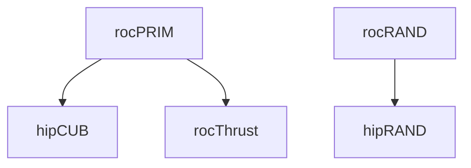

# Continuous Integration

> [!IMPORTANT]
> This document is currently in **draft** and may be subject to change.

This document is to detail the various continuous integration (CI) systems that are run on the rocm-libraries monorepo.

## Table of Contents
1. [Azure Pipelines](#azure-pipelines)
    1. [Overview](#az-overview)
    2. [PR Workflow](#az-workflow)
    3. [Interpreting Results](#az-results)
    4. [Build and Test Coverage](#az-coverage)
    5. [Downstream Job Triggers](#az-downstream)
2. [Math CI](#math-ci)
    1. [Overview](#math-overview)

## Azure Pipelines

> [!IMPORTANT]
> Azure CI checks are currently a **hard requirement** for PRs to be approved and merged.

### Overview 

The Azure Pipelines CI is a public-facing CI system that builds and tests against latest public source code. It encompasses almost all of the ROCm stack, typically pulling source code from the `develop` or `amd-staging` branch on a component's GitHub repository. The CI's main source is publically available at [ROCm/ROCm/.azuredevops](https://github.com/ROCm/ROCm/tree/develop/.azuredevops).

Each component in the monorepo has a corresponding pipeline, see the [Azure monorepo dashboard](https://dev.azure.com/ROCm-CI/ROCm-CI/_build?definitionScope=%5Cmonorepo) for a full list. These pipelines are set to run for PRs and commits that make changes to a component's subfolder, and the conditions for each component are defined in the trigger files under [/.azuredevops](https://github.com/ROCm/rocm-libraries/tree/develop/.azuredevops).

When running a job, Azure CI will dynamically pull the latest passing build from each individual ROCm component's pipeline. The result is that each run will have a ROCm stack that represents the current state of public source code.

### PR Workflow 

1. PR is submitted
2. Azure scans the PR contents to decide which pipelines to run
    1. If a pipeline matches, a run will be kicked off
    2. If a pipeline does not match, the check will be skipped and reported as neutral
3. The PR is built and tested against latest public source
4. The final check status is posted on the PR
5. To see details on a specific check, click into the check, then click `View more details on Azure Pipelines`

### Interpreting Results 

Any errors or warnings during a run will be highlighted on the run's main page on Azure, and clicking on those will bring you directly to the offending logs.

Azure runs can have the following statuses: `Success`, `Failed`, or `Warning`. This corresponds to GitHub status checks as follows:

| Azure Status | GitHub PR Status | Explanation |
|-|-|-|
| ✅ Success | ✅ Succeeded | The job was successful. |
| ⚠️ Warning | ✅ Succeeded with issues | An allowed failure occurred and the job continued on without further issue. |
| ❌ Failed | ❌ Failing | The job failed. |
| Did not run | ⬛ Neutral | The job did not run, likely due to not fulfilling the trigger requirements. |

Warnings can occur if a step fails but was marked as being allowed to fail, so a job will continue running in the event of a warning.

In particular, steps are allowed to fail if they have the property `continueOnError: true` ([reference](https://learn.microsoft.com/en-us/azure/devops/pipelines/process/tasks?view=azure-devops&tabs=yaml#task-control-options)).

### Build and Test Coverage 

Build coverage:
| | Ubuntu 22.04 | Almalinux 8 |
|-|-|-|
| **gfx942** | ✅ Supported | ✅ Supported |
| **gfx90a** | ✅ Supported | ✅ Supported |
| **gfx1201** | 🚧 In progress | 🚧 In progress |
| **gfx1100** | 🚧 In progress | 🚧 In progress |
| **gfx1030** | 🚧 In progress | 🚧 In progress |

Test coverage:
| | Ubuntu 22.04 | Almalinux 8 |
|-|-|-|
| **gfx942** | ✅ Supported | ❌ Unsupported |
| **gfx90a** | ✅ Supported | ❌ Unsupported |
| **gfx1201** | ❌ Unsupported | ❌ Unsupported |
| **gfx1100** | ❌ Unsupported | ❌ Unsupported |
| **gfx1030** | ❌ Unsupported | ❌ Unsupported |

Azure CI builds and tests primarily on Ubuntu 22.04 LTS and for `gfx942` and `gfx90a` architectures, and adding build support for more architectures and operating systems is in progress. Each architecture and OS combination will have its own build and test jobs, all of which will appear as separate checks.

For example, a hipCUB PR may see the following checks, and the naming scheme is hopefully self-explanatory:
- `hipCUB_build_ubuntu2204_gfx942`
- `hipCUB_build_ubuntu2204_gfx90a`
- `hipCUB_test_ubuntu2204_gfx942`
- `hipCUB_test_ubuntu2204_gfx90a`

The majority of component tests are run by running `ctest` or `gtest`. Component-specific details such as build flags and test configurations can be viewed in a component's main pipeline file in [ROCm/ROCm/.azuredevops/components](https://github.com/ROCm/ROCm/tree/develop/.azuredevops/components).

### Downstream Job Triggers 

Azure CI runs for a component will trigger runs for downstream components (provided that they are fully migrated onto the monorepo). The end goal is to catch upstream breaking changes before they are merged and to ensure the monorepo is always in a valid state.

For example, a rocPRIM PR will trigger an initial rocPRIM job. If it succeeds, it will then trigger hipCUB and rocThrust jobs. The two downstream jobs will pull the build from the initial rocPRIM job to ensure that the rocPRIM changes do not break their own functionality.

Currently, the following downstream trigger paths are enabled:

## Math CI

### Overview 
